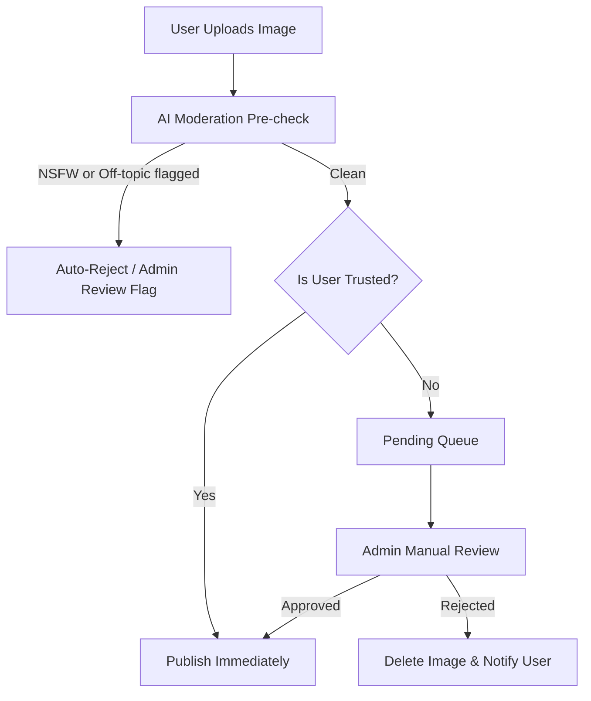

# Laqta (لقطة) — Project Overview & Requirements

**Laqta (لقطة)** is an open-source, community-driven Syrian stock image hosting platform. It serves as the official media server of the **SyrianZone** ecosystem, hosted under the subdomain `laqta.syrian.zone` (or similar). The platform focuses on preserving, archiving, and showcasing Syrian captured imagery (architecture, nature, daily life, historical landmarks, etc.) for public use in software, content creation, and media.

---

## 1. Project Objectives
- **Archiving Syrian Heritage**: Provide a centralized, high-quality repository for modern and historical Syrian photography.
- **RTL & Arabic First**: Create a highly refined, culturally relevant user experience that prioritizes the Arabic language, while remaining fully accessible in English.
- **Software & API Friendly**: Allow developers, designers, and software applications to easily query, search, and embed Syrian images at various pre-rendered resolutions.
- **Open and Shared**: Maintain a public-only catalog where all approved content is accessible, indexable, and search-optimized (SEO).

---

## 2. Target Audience & Personas

### A. Guests (Browsers & Consumers)
- **Who**: Designers, software developers, journalists, content creators, and the general public.
- **Actions**: Browse categories, search by tags/description, download images in multiple dimensions, copy API/attribution snippets.

### B. Registered Contributors
- **Who**: Syrian photographers (amateur and professional) and individuals wanting to share their captured stock.
- **Actions**: Sign up via Google, upload images in original/full-quality, manage their own albums, edit metadata (descriptions, tags, categories), delete their images/accounts, select credit preferences.

### C. Trusted Contributors
- **Who**: Verified photographers with a track record of high-quality, safe, and accurate uploads.
- **Actions**: Same as Registered Contributors, but their uploaded images bypass the Admin/Moderator approval queue and are published immediately.

### D. Administrators & Moderators
- **Who**: SyrianZone core team members.
- **Actions**: Manage the moderation queue (approve/reject uploads), promote users to "Trusted" status, block abusive users, manage system categories/tags, and override auto-moderation settings.

---

## 3. Core Functional Requirements

### 3.1. Authentication & User Accounts
- **Google Sign-In**: Exclusively utilize Google OAuth for registration and login using any public Google account, reducing friction and eliminating password storage risks.
- **Profile Management**: Users can set their display name, bio, and visual credit format.
- **Privacy Boundaries**: Restrict public exposure of personal details. User email addresses and Google authentication metadata must never be exposed publicly or via public API endpoints.
- **Right to be Forgotten**: Absolute account deletion. Deleting an account must purge all personal details and delete all associated uploaded images from the database and storage backend.

### 3.2. Image Uploading & Metadata
- **High-Quality Storage**: Accept high-resolution raw formats (JPEG, PNG, WEBP, HEIC) and preserve the original quality files in secure object storage.
- **Metadata Fields**:
  - **Title & Description**: Arabic (primary) and optional English descriptions to maximize accessibility.
  - **Categories**: Standardized groups (e.g., *Damascus, Aleppo, Nature, Food, Daily Life, Historical landmarks*).
  - **Tags**: Multi-select tags for granular searching.
  - **Albums**: User-created collections to group related shots.
- **Licensing & Attribution Credit Options (Creative Commons support)**:
  - **CC0 1.0 (Public Domain / No Credit Required)**: Users can copy, modify, and distribute the image, even for commercial purposes, without asking permission or providing attribution.
  - **CC BY 4.0 (Attribution Required)**: Allows reuse with attribution. The contributor specifies *how* they want to be credited (e.g. custom name or portfolio link).
  - **CC BY-NC 4.0 (Non-Commercial / Attribution Required)**: Allows reuse with attribution for non-commercial purposes only.
  - **CC BY-SA 4.0 (Share-Alike / Attribution Required)**: Requires any modified versions of the image to be licensed under the same terms.
- **Public Only**: There is **no private image setting**. Every approved image is visible to the public.

### 3.3. Search, Taggable System & SEO
- **Semantic & Full-Text Search**: Search by title, description, category, and tags in Arabic and English, utilizing advanced text indexing to handle Arabic morphology.
- **Automated Alt Text**: If a contributor doesn't provide alt text, the system uses AI image captioning or description metadata to generate rich alt texts.
- **Search Engine Optimization (SEO)**:
  - **Server-Side Rendering (SSR)** for image pages to guarantee full page pre-rendering for search crawlers.
  - **Explicit Locale Routing**: Paths prefixed with locales (e.g. `/ar/photos/{slug}` and `/en/photos/{slug}`) mapped with `hreflang` header metadata to optimize multi-language indexing.
  - Structured metadata schema (`schema.org/ImageObject`) embedded in every page.
  - Friendly URL slugs (e.g., `/photos/al-hamidiyah-souq-1234`).
  - Automatically generated sitemaps.

### 3.4. Image Processing & Delivery
- **Varied Resolutions**: Original upload is preserved, but served via CDN in multiple formats:
- **Raw/Original**: High-res download, protected against scraping bots by a Cloudflare Turnstile CAPTCHA and rate-limited.
  - **Web-Optimized (Large)**: Recommended for website backgrounds/banners.
  - **Standard (Medium)**: Recommended for blogs and regular content.
  - **Thumbnail (Small)**: Recommended for search grids and previews.
- **API Access**: Provide a public JSON API for querying images, tags, and categories. Developer API keys are required for software integrations to throttle requests and prevent catalog harvesting.

### 3.5. Moderation Pipeline

- **Automated AI Moderation**: Scans images on-upload via the OpenRouter API (utilizing visual AI models like Gemini 2.5 Flash) for adult content, violence, hate symbols, or non-Syrian-related content based on automated safety instructions.
- **Admin Approval Queue**: Moderation dashboard showing pending images with AI evaluation summaries and safety confidence scores to speed up manual review.

